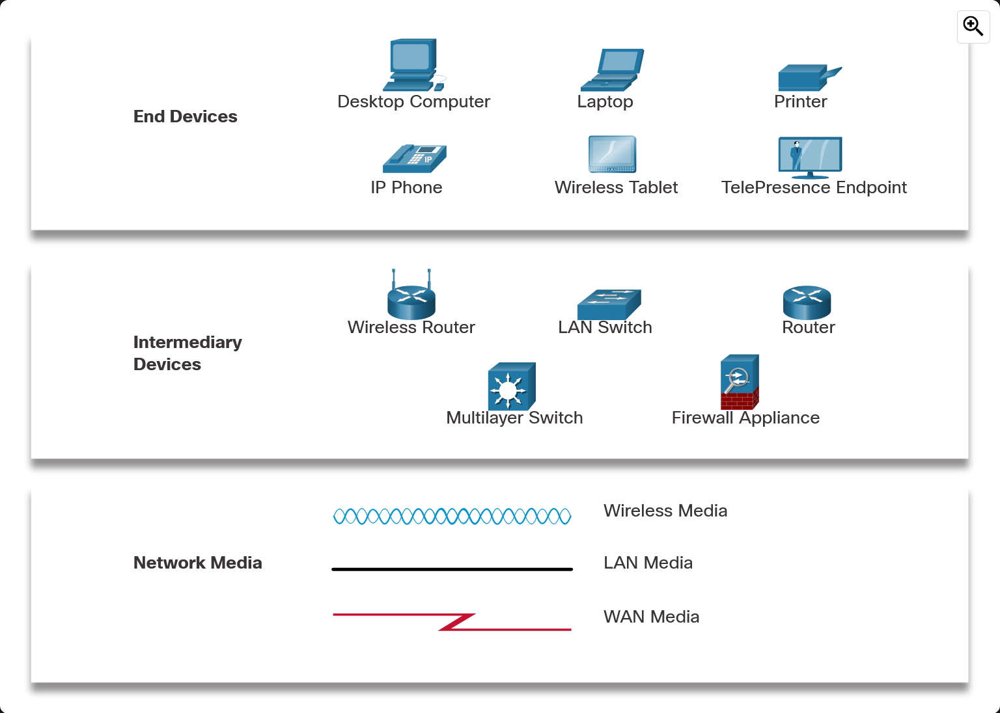

# Module 2: Network Components, Types, and Connections

## Section 1: Clients and Servers

### Clients, Servers, and Hosts

_Hosts_ are devices that are able to send and receive messages on a network.
Hosts can either be _clients_ and/or _servers_ depending on the software installed to them.
Servers are devices that have software installed to them that allows for other hosts to request
information from them, and for them to respond. Conversely, clients are devices that have software
installed to them that allows for them to request and receive information from servers.

### Peer-to-Peer (P2P) Networks

When a host can act as both a server and a client, it can act as part of a peer-to-peer (P2P)
network. While peer-to-peer networks are easy to set up, less complex, and have lower costs,
they are primarily for simpler tasks such as transferring files or sharing printers. However,
when P2P networks are used for more complex tasks, they are not as secure, not scalable, have
no centralized administration, and may slow network performance due to hosts acting as both
roles.

Hosts are not bound to a single instance of client and/or server software, they can have multiple
installed that handle different types of information. Additionally, a single client may connect
to multiple servers simultaneously and a single server may connect to multiple clients 
simultaneously.

## Section 2: Network Components

### Network Infrastructure

Network infrastructure components are the elements of a network that are connected together.
Networking hardware, a type of component, can be categorized as either an end device, intermediary 
device, or network media. Media, such as wireless, which are not visible are still components.

Common types of hardware (transcribed from the image above):
- End Devices
  - Desktop Computers
  - Laptops
  - Printers
  - Tablets
  - Smart TVs
- Intermediary Devices
  - Wireless Routers
  - LAN Switches
  - Routers
  - Multilayer Switches
  - Firewall Appliances
- Network Media
  - Wireless
  - LAN
  - WAN

#### End Devices

Devices that are most commonly interacted with by users of a network are _End Devices_ AKA _Hosts_.
An end device is either the source or destination of a message on a network. As such, end devices
need to be uniquely identifiable; that's where addressing comes in. Communication between hosts
are facilitated by specifying the destination _address_ of the message, while the source address
is implicitly the address of the message's author.

## Section 3: ISP Connectivity Options

An _Internet Service Provider_ (ISP) serves as the link between a home network and the internet.
An ISP can come in many forms: a local cable provider, a land-line or cellular telephone service 
provider, among others. Additionally, they may offer additional services such as email, network 
storage, etc. ISPs connect together in a hierarchical manner to form the backbone of the internet. 
This connection hierarchy allows for data to take the shortest path to its destination. They 
usually connect through fiber-optic cables that span underground between cities, states, 
countries, and continents.

Users can connect to their ISPs through a cable modem. The simplest method of connection is to
directly connect and end device to the modem over ethernet, but that should be avoided for
security purposes. The more common method is to connect the modem to a wireless integrated
router that proxies both wired and wireless connections to the modem, provides LAN capabilities
with client addressing, and adds an additional layer of security.

> A wireless integrated router merges the responsibilities of a network switch for wired
> capabilities and a WiFi access point (wireless AP) for wireless. 

### Cable and DSL Connections

Most users connect to their ISPs with one of two methods: Cable or Digital Subscriber Lines (DSLs).
_Cable_ is typically offered by cable television service providers and supplies a high bandwidth,
always on, connection to the internet. This is carried over a coaxial cable along side cable 
television. A cable modem is required to use the internet access on the coaxial cable. 

Similarly, DSLs also provide the aforementioned features and require a special high-speed modem. 
But the signals the modem separates the internet from are telephone signals instead of cable 
television. DSL runs over a telephone line and is split into three channels: voice telephone 
calls, download, and upload. DSL upload channels are usually slightly slower than the download 
channels. The quality of the connection depends of the quality of the phone line as well as the 
distance from the central office of the phone company.

Other connection methods exist such as cellular, dial-up telephone, or satellite, but are less 
common. These can be used in areas where it is difficult to get cable or DSL at the cost of higher 
cost, less bandwidth, and slower speeds.

## Section 4: Summary

> Quiz Results: 10/10