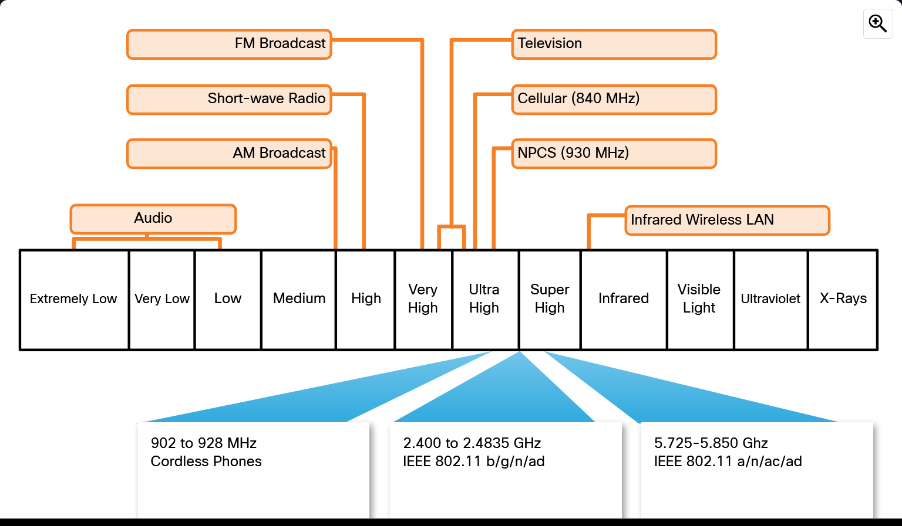

# Module 4: Build a Home Network

## Section 1: Home Network Basics

- ISPs connect to modems.
- Routers distribute the modem's internet connection to LAN ethernet ports. 
  - Routers may integrate a modem into them. 
  - Routers may also contain a wireless access point.
- Wired (LAN) connections usually are addressed the same as wireless connections.

Home routers typically have two types of ports: LAN/Ethernet ports and an internet/WAN port.
The LAN/Ethernet ports are all on the same LAN network wheres the internet port connects
the router to a different network, usually a cable or DSL modem. Additionally, many home routers
include radio antenna and a builtin wireless access point.

In addition to a modem and router, or an integrated router, many end devices/hosts are connected
to a home network as well.

## Section 2: Network Technologies in the Home

### LAN Wireless Frequencies

IEEE 802.11 standards have many technologies that conform to them on the 2.4 and 5 GHz ranges.
WiFi is one such technology that usually falls in the unlicensed 2.4 and 5 GHz frequency ranges. 
Bluetooth similarly uses 2.4 GHz but is not 802.11 compliant, but it's lower power shortens the 
range and throughput when compared to WiFi. Some ranges of the EM spectrum require permits to use.

### Wired Network Technologies

As with wireless, wired technologies similarly have protocols and standards, the most common of
which being Ethernet. Ethernet is a collection of protocols that allows for wired LAN 
communication and supports multiple types of wiring media. Devices can be directly connected
together using an Ethernet patch cable (usually an unshielded twisted pair). Ethernet cables
use RJ45 connectors that are usually preinstalled.

Recent homes may be wired with Ethernet jacks in wall connectors, but otherwise there are other
methods, such as Powerline, that can distribute connectivity.

The most commonly used wired media in LAN are Category (Cat) 5e Ethernet Cables. They have four
pairs of wires that are twisted to reduce electrical interference. Coaxial cables have a single
heavily shielded wire and fiber-optic cables very fine (around the diameter of a human hair)
glass or plastic cables that can carry information at very high speeds over long distances.

## Section 3: Wireless Standards

In order to facilitate unified wireless communication, the Institute of Electrical and Electronics 
Engineers (IEEE) have created a number of standards that specify, for instance, the RF spectrum
used, data rates, how the information is transmitted, etc.

802.11 standardizes WLAN environments. Amendments to 802.11 are made to describe characteristics
for different standards of wireless communication. WiFi technologies refer to the collection
of wireless LAN standards that use the 2.4 and 5 GHz frequency ranges.

Devices are certified to be compatible for a WiFi standard via the WiFi Alliance, an organization 
responsible for testing devices from different manufacturers.

Wireless routers provide a variety of options to configure their networks. A few such options are
listed below:
- Network Mode - Determines the type of technology that must be supported (i.e. 802.11b, 802.11g, 802.11n, or Mixed Mode).
  - When not in Mixed Mode, the network is able to maximize its throughput as it does not need to deal with multiple standards. Mixed Mode is common and allows for devices of all ages to connect.
- Network Name (SSID) - A unique identifier for the WLAN.
- Standard Channel - The channel over which communication will occur; set to Auto by default.
- SSID Broadcast - Whether to tell others the network exists.
  - SSID = Service Set Identifier; case-sensitive, alphanumeric, up to 32 characters.

## Section 4: Set Up a Home Router

Many wireless routers come with an automatic setup utility that can be ran from a PC or laptop
connected to a LAN port on the router. If the router has an integrated modem, check that the type
of connection is correct for the ISP; BNC-type connectors for coaxial cables and RJ11 connectors
for DSLs.

Devices on a network, wired or not, require a unique IP address, subnet mask, default gateway, and 
DNS servers that usually is assigned to them via DHCP (Dynamic Host Configuration Protocol), but 
other times needs to be manually specified.

### Network Design Considerations

- Do not include an identifiable information about the router in its SSID if broadcasting.
- Chose the most specific network mode for the devices that will be connecting to the network.
  - Enabling legacy/mixed mode provides an environment compatible with most standards, though the specific combinations vary by manufacturer.
- Some wireless routers allow for the configuration of a guest access network that is more open but has usage restrictions.

### PT 4.4.4 - Configure a Wireless Router and Client

- The default username and password for PTs wireless router is `admin`/`admin`.
- By default, wireless networks are off and need to be configured in the Wireless tab.
  - Don't forget to enable security and choose a password.

## Section 5: Summary

> Quiz Results: 10/10

> I enjoyed learning about standards like the briefly mentioned 802.11 ones and the internals
> of the various types of wired media.