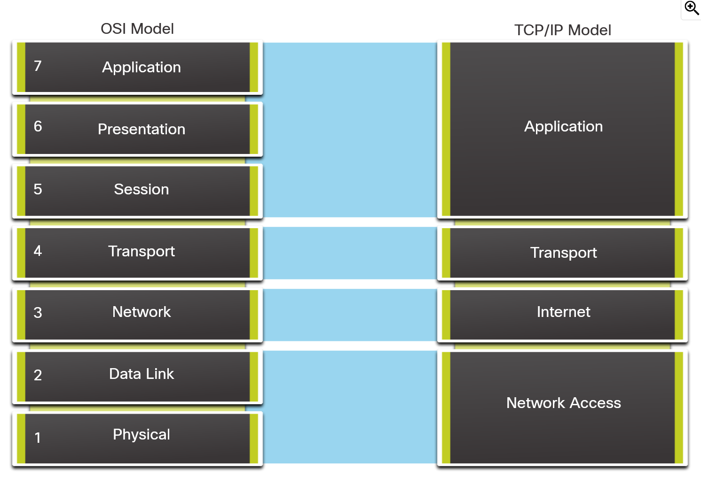

# Module 5: Communication Principles

> Networking is built on the assumption of standardization.

## Section 1: Communication Protocols

As with human conversations, computer conversations must follow pre-established rules in order
to make sure that what is being said is understood properly. A local network is defined as an
area where all hosts must "speak the same language" or rather share a common protocol.

Below lists common characteristics of network protocols:
- Message format
- Message size
  - Sizing rules are _very strict_ and determine when a message is complete (as they can be broken into multiple parts.)
- Timing
  - This determines both the throughput of a network and how much and when hosts can send data.
- Encoding
  - Messages are first encoded into bits that must later be decoded by the destination host.
- Encapsulation
  - This wraps a message in an "envelope" with the addressing and other information of the recipient.
- Message pattern
  - Some messages require acknowledgment of it being received (i.e. TCP) whereas others do not (i.e. UDP).

## Section 2: Communication Standards

### Protocols

While we can see the network as a topology of the various devices, each device
only knows themselves. In order to communicate with other devices on or off the
network, they send _packets_ in accordance to various _protocols_.

- Ethernet/WLAN Protocols: `DHCP` and `ICMPv6`
  - Can give devices their IP addressing information
  - What network they belong to
  - The address of the default gateway - where the devices send out of network
    traffic
  - The address of the DNS server which handles domain name to IP address
    translation
- `TCP` is a method of ensuring the `IP` packets get to their destination and
  can have devices re-send packets if any are dropped.

A single packet can be comprised of a multitude of protocols. For instance, when we request a web page,
some of the packets we receive contain all four of the Ethernet, IP, TCP, and HTTP protocols. All the
protocols have their own purpose and by combining them, more complex networking behavior can be enabled.

### Standards

_Standards_ are a set of rules that a compliant implementation of something
must follow. They allow for different devices (i.e. a PC and mobile device)
to communicate successfully (i.e. send and receive emails).

Standards follow a life cycle comprised of discussion, problem solving, and testing. This conversations
are developed, published, and maintained by a variety of organizations. Each stage of the life cycle is
proposed in a numbered Request for Comment (`RFC`) managed by the Internet Engineering Task Force (`IETF`).

## Section 3: Network Communication Models

### TCP/IP Model

The _TCP/IP Model_ of networking communication is made up of four layers. Protocols can be grouped into
each of the below layers. Having a layered model provides many benefits such as allowing different vendors
to work together, being able to change one level without affecting others, and providing a common language
for networking functions and capabilities.

The Internet Model, more commonly referred to as the TCP/IP Model, was the first developed layered model for 
networking communications and was developed in the early 1970s.

1. Application - Represents user data, plus encoding and dialog control.
  - HTTP
2. Transport - Supports communication between various devices across networks.
  - TCP, UDP
3. Internet - Determines the best path through the network.
  - IP
4. Network Access - Controls the hardware devices and media that make up the network.
  - Ethernet

### `OSI` Reference Model

While the TCP/IP Model closely matches the structure of a particular protocol suite (as such is called a 
_Protocol model_), another type of model called a _Reference model_ exists.

A reference model instead describes the functions that must be completed at a particular layer, instead of 
_how_ a function should be accomplished. The most widely known of these models is the Open Systems
Interconnection (OSI) project from ISO.

The OSI model is comprised of seven layers:

7. Application - Protocols used for process-to-process communication.
6. Presentation - Common representation of data between application layer services.
5. Session - Provides services to the presentation layer to organize its dialogue and manage data exchange.
4. Transport - Services to segment, transfer, and reassemble the data for individual communications between
  end devices.
3. Network - Services to exchange the individual pieces of data over the network between identified end devices.
2. Data Link - Methods for exchanging data frames between devices over a common media.
1. Physical - Protocols to describe the physical means to use physical connections for bit transmission between
  network devices.

### Comparison of the models

The TCP/IP Model is specific to the protocols in its suite. The TCP/IP Model
can be described in terms of the `OSI` model. Due to the `OSIs` breakage of 
layers 2 and 3, it's more commonly used when referring to the lower layers.

## Section 4: Summary

> Quiz Results: 10/10

> I had a lot of fun with this module, mind the long intermission in the middle.
> I hadn't seen a comparison of the TCP/IP and OSI models so their relationship was a bit
> jumbled before this.